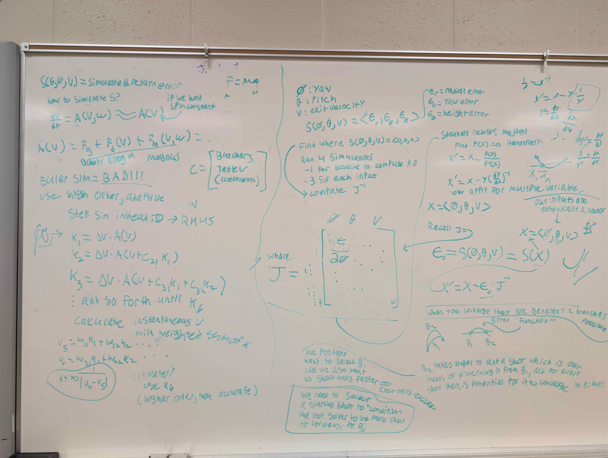

# FRC Ballistic Trajectory Lookup table (WIP)

Designed to compute a look-up table that can handle shoot-on-the-move for ballistic aiming. 
 - position(xy), velocity(xy) -> yaw, pitch, speed

I used RKF45 to simulate projectile motion so that it can accurately account for drag, magnus, and any other forces
 - I made it capable of seamless force integration
  - simply provide a force function given some state parameters to "integrate" over
  - you are essentially solving an ODE of the form:
    - `dv/dt = f(v, omega)` ~ drag + magnus + gravity

For RKF45 I referenced
 - https://en.wikipedia.org/wiki/Runge%E2%80%93Kutta%E2%80%93Fehlberg_method (table, info)
 - https://math.okstate.edu/people/yqwang/teaching/math4513_fall11/Notes/rungekutta.pdf (implementation details)

I chose RKF45 because I wanted to optimize accuracy but also time through its adaptive time stepping. 

To "find" our shot parameters(yaw pitch speed), we can treat our inputs and outputs as vectors, or a matrix as done in the code's implementation. 

Define an error vector function, S(simulation):
 - S(<`yaw`, `pitch`, `speed`>) = <`e_x`, `e_y`, `e_z`> 
  - where `e` represents an error vector that is the displacement from the nearest point on the trajectory to the target
  - One full simulation can be mapped to this very input/output format, and it behaves especially well since it can compose a square jacobian :D

We can then use the the [multi-variable Newton-Raphson Method](https://pages.hmc.edu/ruye/MachineLearning/lectures/ch2/node7.html) to "find", or converge, the optimal parameters for some given conditions. The computation is relatively unsophisticated, just take the jacobian, invert it, and multiply that to your initial error vector(or matrix) to get a corrective step. The actualization of the end-goal(to select a working shot), however, is not trivial, as you must select optimal error metrics. For example, you must consider the conditions under which your standard newton method operates, i.e, a well-behaved curve or surface that is continuous. Simply choosing the end position-to-target displacement as your error vector will yield unstable metrics since these can suddenly "jump" upon collisions in the simulation, which creates discontinuities. Previously, as seen in the whiteboard attachment, I used error in yaw, pitch, and height. Currently, I've arrived at using the point in your trajectory that is the closest to the target position, this should theoretically yield mostly continuous error vectors over variations in our input parameters(yaw pitch speed), since then collisions should less often propagate these discontinuities as seen in the simple end-position-to-target displacement vector. It's also important to consider that there are generally 2 trajectories this solver can converge to, and it is critical to recognize them. **The rest of this paragraph is theoretical observation, but much anticipated.** These branches are a manifestation of the fact that you can have a high trajectory and you can have a low trajectory, among infinitely possible trajectories. Due to the nature of the solver, this being a root solver, we need to find *a* zero, but that doesn't mean it will always converge to the same 'type' of zero. The best option is to condition your initial guess to incline the solver to prefer one branch(preferably a higher trajectory so as to eject balls more quickly since higher arch => greater speed). Another approach is how we can can discern these branches, generally, a higher arc would imply a greater flight time, so if we were to regress the output of this simulated table, we would only regress trajectories of the same branch. If we didn't do this, we could expect to have a useless interpolation table, since due to the nature of this process, you would essentially have 2 trajectory 'surfaces' imposed onto one table, which creates jagged and noisy data that is unfit for interpolation(you cannot feasibly regress a dataset that has 2 functions embodied within it, you would be left with an 'average' of the 2 which renders the regression generating a distinctly inaccurate surface to both branches).

This has been quite the passion project I must say, and in this process(~60 hours in the past couple weeks) I've learned much linear algebra, numerical analysis, and physics. Being a perfectionist, I also seek to make things perfect and beautiful, which has led me to put much thought into the architecture of this project: a thorough emphasis on functionally independent systems that come together as cohesive instruments for this simulation / table.

I've split this project into a couple parts:
#### The Integrator 
This class only knows what a vector state is, which keeps track of position, velocity, and such during the process of simulating an object under complex forces like drag and magnus. This integrator class takes a resolution profile and a force function, which sound exactly what they are: the former, an object that determines how small your step sizes should be calculated and other things like max iterations for adaptive step sizes, and the latter, a function which takes the current velocity and other states such as your spin and calculates a net acceleration(gravity + drag + magnus). This force function is used to calculate each `k` in the RKF45 process, or simply put, a sampled future/potential acceleration to be weighed according to the [Butcher tableau](https://en.wikipedia.org/wiki/Butcher_tableau). As of right now the implementation effort might have been nullified by how I calculate/step position, but that will be later addressed, and at bare minimum, velocity seems to be stepping correctly. 
#### The Adaptive System
This class is the meat of how trajectories, or parameters, are calculated. I've abstracted it into a simple jacobian solver: It takes an error function(matrix in matrix out), and an error quantifier(matrix in, number(double) out). You perturb each input individually, measure the new errors from the baseline error, and compose your jacobian to calculate a correction. You apply this iteratively, and this class exposes a simpleConverge method which caps iterations if not meeting an error threshold or tolerance, and will return the input of least error over all iterations. 
#### Ballistic Projectile State
This class implements the vector state utilized by the integrator, and expands it for ballistic use and simulation. It can detect if it has collided with an obstacle, reached a target position, or went out of bounds. It can step, but it doesn't simulate, as this functionality is left to the precomputer. 
#### The Ballistic Precomputer
This class is essentially what orchestrates everything, it defines a force function, establishes the simulation environment(it takes an environment profile for things like gravity, and drag coefficents) and implements the adaptive system to converge to a working trajectory. As of right now, it can attempt to iterate over all positions and velocity to produce a working, but as this system is still a work in progress, it's not yet meant to generate the table. 

*Here is a whiteboard overview, which is outdated and used an older error metric for convergence.*
